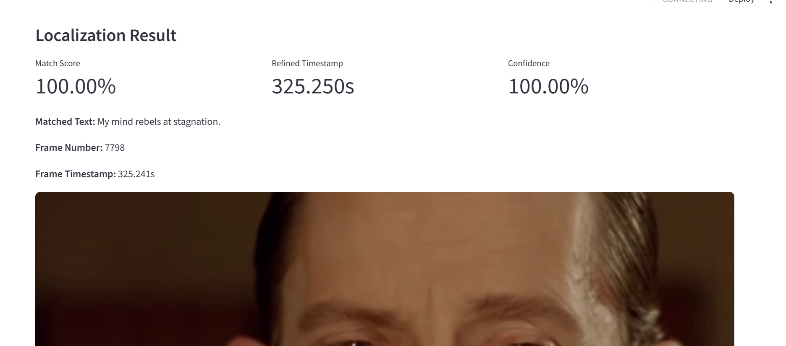

# Quest1 — Exact Dialogue Frame Detection

> **An automated video analysis system that identifies the first video frame in which a specified dialogue appears.**

**Given a publicly accessible video or a local video file and a target dialogue, the system processes the video, transcribes its audio, locates the matching dialogue, refines the timestamp, and extracts the corresponding video frame.**

## Problem Statement

Given a video and a target dialogue, the system must automatically identify:

- The first frame containing the target dialogue
- The corresponding timestamp
- The frame number
- The extracted dialogue text
- The corresponding frame image

The system is designed to reduce the manual effort required to locate a specific spoken dialogue within a video.

---

## Key Features

- Video-based dialogue localization
- Automatic audio extraction
- Speech-to-text transcription using Whisper
- Fuzzy dialogue matching using RapidFuzz
- Timestamp refinement at frame level
- Exact frame extraction using OpenCV
- Confidence/match score reporting
- Command-line pipeline
- Streamlit-based user interface
- Support for large video uploads up to 1 GB
- Modular Python architecture
- Unit tests for core components

---

## System Pipeline

```text
Video
  │
  ▼
Audio Extraction
  │
  ▼
Whisper Transcription
  │
  ▼
Dialogue Matching
  │
  ▼
Candidate Timestamp
  │
  ▼
Timestamp Refinement
  │
  ▼
Exact Frame Extraction
  │
  ▼
Result
````

The final result contains the matched dialogue, match score, refined timestamp, frame number, frame timestamp, and extracted frame image.

---

## Example Result

For the target dialogue:

> "My mind rebels at stagnation."

The tested pipeline produced:

```text
Matched text: My mind rebels at stagnation.
Match score: 100.00
Candidate timestamp: 325.100s
Refined timestamp: 325.250s
Frame number: 7798
Frame timestamp: 325.241s
```

The corresponding frame is written to:

```text
data/output/exact_dialogue_frame.jpg
```
### Localization Output


---

## Project Structure

```text
quest1-exact-dialogue-frame/
│
├── app.py                         # Streamlit application
├── main.py                        # Main CLI entry point
├── requirements.txt
├── README.md
├── .gitignore
│
├── docs/
│   ├── AI_PROMPTS.md
│   ├── APPROACH.md
│   ├── BRD.md
│   ├── DESIGN_DECISIONS.md
│   ├── DEVELOPMENT_LOG.md
│   ├── TECHNICAL_REQUIREMENTS.md
│   ├── TECH_STACK_DECISION.md
│   ├── TESTING.md
│   └── VIDEO_CHARACTERIZATION.md
│
├── src/
│   ├── acquisition/
│   │   └── video_downloader.py
│   │
│   ├── confidence/
│   │   └── scorer.py
│   │
│   ├── matching/
│   │   └── text_matcher.py
│   │
│   ├── ocr/
│   │   ├── base.py
│   │   └── easyocr_engine.py
│   │
│   ├── output/
│   │   └── result_writer.py
│   │
│   ├── pipeline/
│   │   ├── dialogue_locator.py
│   │   ├── fine_localization.py
│   │   ├── frame_locator.py
│   │   └── localize_dialogue.py
│   │
│   ├── search/
│   │   ├── coarse_search.py
│   │   ├── fine_search.py
│   │   └── frame_locator.py
│   │
│   ├── transcription/
│   │   └── whisper_transcriber.py
│   │
│   └── video/
│       ├── characterize.py
│       ├── create_contact_sheet.py
│       ├── dense_sample.py
│       ├── extract_samples.py
│       ├── frame_extractor.py
│       ├── metadata.py
│       ├── refine_frame.py
│       ├── scan_video.py
│       ├── transcribe.py
│       └── word_timestamps.py
│
└── tests/
    ├── test_matching.py
    └── test_metadata.py
```

---

## Technology Stack

| Component            | Technology     |
| -------------------- | -------------- |
| Programming Language | Python         |
| Video Processing     | FFmpeg, OpenCV |
| Speech Recognition   | OpenAI Whisper |
| Text Matching        | RapidFuzz      |
| OCR                  | EasyOCR        |
| Video Downloading    | yt-dlp         |
| User Interface       | Streamlit      |
| Testing              | pytest         |

---

## Installation

### 1. Clone the repository

```bash
git clone https://github.com/shyaamsundar2310422/quest1-exact-dialogue-frame.git
cd quest1-exact-dialogue-frame
```

### 2. Create a virtual environment

```bash
python -m venv .venv
```

### 3. Activate the environment

Windows:

```bash
.venv\Scripts\activate
```

### 4. Install dependencies

```bash
pip install -r requirements.txt
```

The main dependencies include:

```text
opencv-python
easyocr
rapidfuzz
yt-dlp
pytest
openai-whisper
streamlit
```

FFmpeg must also be available for video/audio processing.

---

# Running the Application

## Streamlit UI

Start the application with:

```bash
streamlit run app.py
```

The UI allows the user to provide a video and target dialogue and run the localization pipeline interactively.

### Upload Limit

The Streamlit application supports video uploads up to:

```text
1 GB
```

Large video files are processed locally and are not stored in the Git repository.

---

## Command-Line Usage

The end-to-end localization pipeline can also be executed from the command line.

Example:

```bash
python -m src.pipeline.localize_dialogue ^
  --video data/input/query_video.mp4 ^
  --target "My mind rebels at stagnation."
```

The pipeline performs:

1. Audio extraction
2. Whisper transcription
3. Target dialogue matching
4. Candidate timestamp identification
5. Timestamp refinement
6. Exact frame extraction
7. Result generation

---

# Whisper Model

The project uses the Whisper `tiny.en` model for English speech transcription.

The model is stored locally and is intentionally excluded from version control.

The repository therefore does **not** contain the large model file itself.

When running the project on a new machine, the required model must be available locally or downloaded by the configured Whisper workflow.

---

# Output

A successful localization produces information similar to:

```json
{
    "target": "My mind rebels at stagnation.",
    "matched_text": "My mind rebels at stagnation.",
    "match_score": 100.0,
    "candidate_timestamp": 325.1,
    "refined_timestamp": 325.25,
    "frame_number": 7798,
    "frame_timestamp": 325.241,
    "fps": 23.97606434000623,
    "frame_path": "data/output/exact_dialogue_frame.jpg"
}
```

The extracted frame is saved under:

```text
data/output/
```

Generated videos, audio files, model files, and temporary processing artifacts are excluded from Git.

---

# Matching Approach

The system first obtains a speech transcript from the video's audio track.

The target dialogue is normalized and compared against transcript segments using fuzzy text matching.

RapidFuzz is used to calculate the similarity score and identify the best candidate segment.

The candidate timestamp is then refined to obtain a more precise frame-level location.

This approach separates:

```text
Speech-level localization
        ↓
Timestamp refinement
        ↓
Frame-level localization
```

---

# Frame Localization

Once the refined timestamp is obtained, the system maps the timestamp to the corresponding video frame using the video's frame rate.

The final frame is extracted using OpenCV and saved as an image.

This allows the system to return an actual video frame rather than only a timestamp.

---

# Testing

The project includes automated tests for core functionality.

Run:

```bash
pytest
```

The test suite currently covers components including:

* Dialogue/text matching
* Video metadata handling

Additional end-to-end validation was performed using the reference video and target dialogue.

---

# Documentation

Detailed project documentation is available under `docs/`.

### Requirements and Planning

* `docs/BRD.md`
* `docs/TECHNICAL_REQUIREMENTS.md`

### Architecture and Approach

* `docs/APPROACH.md`
* `docs/DESIGN_DECISIONS.md`
* `docs/TECH_STACK_DECISION.md`

### Development

* `docs/DEVELOPMENT_LOG.md`

### Testing

* `docs/TESTING.md`

### AI Usage

* `docs/AI_PROMPTS.md`

### Video Characterization

* `docs/VIDEO_CHARACTERIZATION.md`

---

# Repository and Data Policy

Large or generated files are intentionally excluded from version control.

The `.gitignore` excludes:

* Python virtual environments
* Python cache files
* Local environment files
* Video files
* Generated audio/video samples
* Generated output files
* Local AI model files
* ASR test artifacts
* Logs

This keeps the GitHub repository lightweight while preserving the complete source code and documentation required to reproduce the system.

---

# Current Status

The project currently provides a working end-to-end dialogue localization pipeline with:

* Video processing
* Whisper transcription
* Dialogue matching
* Timestamp refinement
* Exact frame extraction
* Result generation
* Streamlit interface
* Automated tests
* Project documentation

The system has been validated against the reference dialogue:

```text
"My mind rebels at stagnation."
```

and successfully localized the corresponding frame.

---

## Limitations

* Whisper transcription quality depends on audio quality, language, accents, and background noise.
* Fuzzy matching may require an appropriate similarity threshold for different dialogues.
* Processing time depends on video duration and available CPU/GPU resources.
* CPU-based Whisper inference may be slower than GPU inference.
* Very large videos require sufficient local storage and processing time.

---

## Project Goal

The goal of this project is to provide a reproducible and automated method for locating an exact spoken dialogue within a video and returning the corresponding video frame, reducing the need for manual video inspection.

